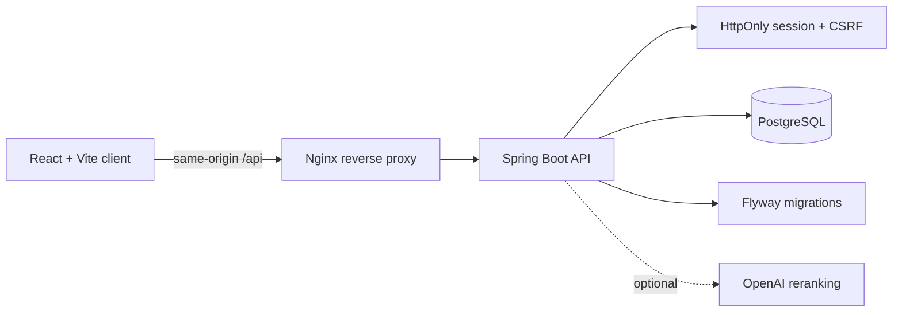
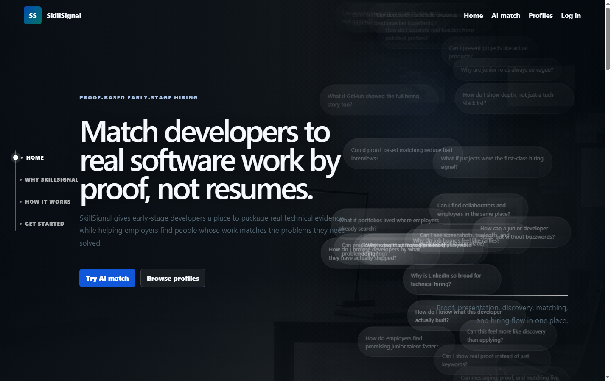
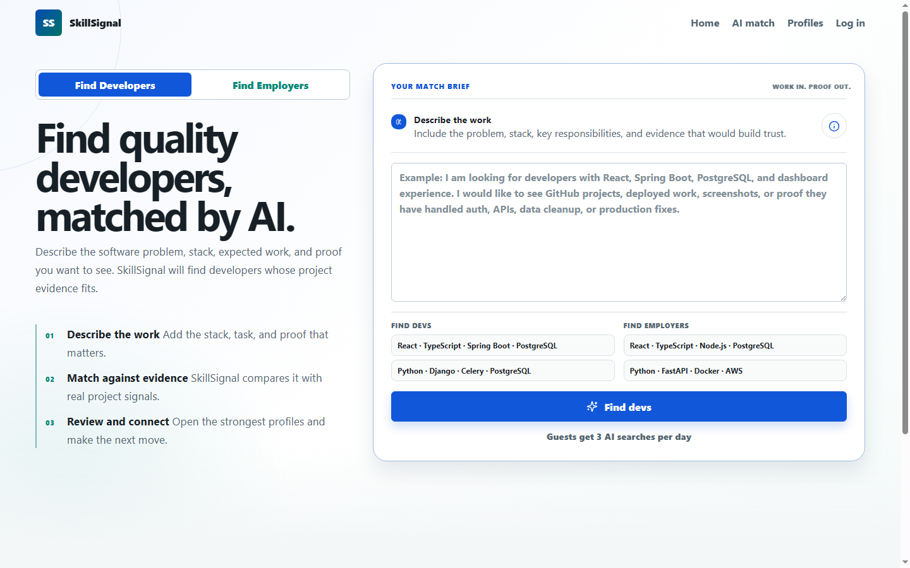
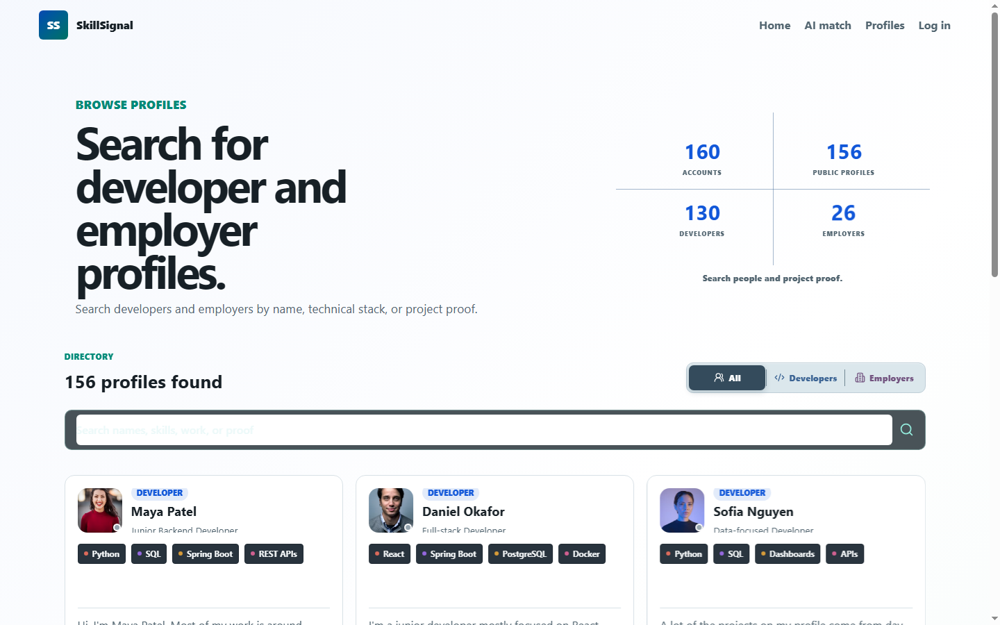

# SkillSignal

SkillSignal is a full-stack portfolio platform for proof-based hiring. Junior developers build profiles around projects, skills, and evidence; employers search by proven technical problems instead of generic resume keywords.

## Stack

- Backend: Spring Boot, Spring Security, JWT, Spring Data JPA
- Frontend: React, Vite, React Router
- Database: PostgreSQL

## Project Layout

```text
backend/   Spring Boot API
frontend/  React client
```

## Quick Start

### 1. Start PostgreSQL

Create a local environment file first:

```bash
copy .env.example .env
```

Set `POSTGRES_USER`, `POSTGRES_PASSWORD`, `DB_USERNAME`, `DB_PASSWORD`, and a random `JWT_SECRET` of at least 32 characters in `.env`. Add `OPENAI_API_KEY` if you want to use the AI features. Keep `.env` local; it is ignored by Git.

Then start PostgreSQL:

```bash
docker compose up -d
```

On startup, Flyway applies the versioned schema in `backend/src/main/resources/db/migration`; Hibernate validates the result without modifying it.

### 2. Run the backend

```bash
cd backend
mvn spring-boot:run
```

The API runs on `http://localhost:8080`.

The public readiness check is available at `http://localhost:8080/api/health` and returns JSON with `status: ok` when the API is running.

### 3. Run the frontend

```bash
cd frontend
npm install
npm run dev
```

The app runs on `http://localhost:5173`.

## Optional admin and demo data

No admin account is created unless both admin variables are supplied. Set these in `.env` before the first backend startup if you need an admin:

- `SKILLSIGNAL_ADMIN_EMAIL`
- `SKILLSIGNAL_ADMIN_PASSWORD`

Demo profiles and sample messages are disabled by default. For local demonstrations only, set `DEMO_DATA_ENABLED=true`; do not enable it for production data.

## Starter Auth Flow

- `POST /api/auth/register`
- `POST /api/auth/login`
- Authentication uses an HttpOnly session cookie; state-changing requests use the CSRF cookie issued by `GET /api/auth/csrf`.
- `GET /api/developer/profile` requires `DEVELOPER` or `ADMIN`
- `GET /api/employer/search` requires `EMPLOYER` or `ADMIN`
- `GET /api/admin/moderation` requires `ADMIN`

## Architecture Notes

The product is organized around a proof-first hiring loop:

> Projects are the source of truth, not resumes.

The React client uses role-aware routes and a shared API client. The Spring Boot API owns validation, authorization, profile visibility, messaging, saved candidates, AI quotas, and database access. PostgreSQL stores users, marketplace profiles, skills, connections, conversations, messages, proof signals, and AI usage. Flyway owns schema changes; Hibernate runs in validation mode.



Important trust boundaries:

- Authentication is an HttpOnly session cookie; state changes require the CSRF cookie/header pair.
- Public profile reads only expose profiles that the owner has published.
- Developer and employer records are scoped through the authenticated user id.
- AI searches have server-side daily allowances and a quick-match fallback when the provider is unavailable.

## Employer Demo Flow

For a five-minute walkthrough, enable local demo data with `DEMO_DATA_ENABLED=true`, then:

1. Open the public marketplace and show the proof-backed profile cards.
2. Run an AI Match search for a concrete technical problem such as authentication.
3. Open a candidate profile and point out project descriptions, skills, and evidence.
4. Sign in as an employer, review the dashboard, save a candidate, and send a message request.
5. Sign in as a developer, publish a project-backed profile, accept the request, and reply.

The strongest talking point is the product decision: SkillSignal makes the evidence behind a skill visible before a hiring conversation starts.

## Screenshots







## Verification

Run the backend tests and frontend production build before sharing the project:

```bash
cd backend && mvn test
cd ../frontend && npm ci && npm run build
```

The same checks run in GitHub Actions for pushes and pull requests.

Dependency vulnerability scanning should also be enabled in the hosting provider or CI environment; local `npm audit` requires registry access and is not treated as a substitute for a reviewed production lockfile.

The live journey smoke test can be repeated locally after starting the API:

```powershell
powershell -ExecutionPolicy Bypass -File scripts/api-journey-smoke.ps1
```

It creates temporary accounts, tests publication, project proof, search, saving, messaging, acceptance, and reply delivery, then removes the accounts.

## Known Limitations Before Production

- A public deployment, HTTPS certificate, provider secrets, backups, monitoring, and rollback rehearsal still need to be configured on the chosen host.
- AI reranking is intentionally best-effort and in-memory; a backend restart can discard an in-flight asynchronous rerank result.
- Browser-level journey tests are not yet automated; the checked-in API smoke test covers the critical backend workflow.
- The local demo seed data is for presentation only and must remain disabled for real users.

## Production Container Path

`docker-compose.production.yml` runs PostgreSQL, the API, and the frontend behind one origin. The Nginx frontend container serves the React build and proxies `/api` to the backend, so the session cookie stays same-origin. Provide `POSTGRES_DB`, `POSTGRES_USER`, `POSTGRES_PASSWORD`, `JWT_SECRET`, and `PUBLIC_ORIGIN` through the deployment platform, keep demo data disabled, and put the stack behind the provider's HTTPS certificate.

The production variable checklist is in [`.env.production.example`](.env.production.example); it contains placeholders only and must never be populated and committed.

See [`docs/DEPLOYMENT_RUNBOOK.md`](docs/DEPLOYMENT_RUNBOOK.md) for release, health-check, backup, and rollback steps.

## Current Backend Models

- `AppUser`
- `MarketplaceProfile`
- `AiSearchUsage`
- `DeveloperConnection`
- `DeveloperConversation`
- `DeveloperMessage`
- `ProofSignal`
- `SavedCandidate`
